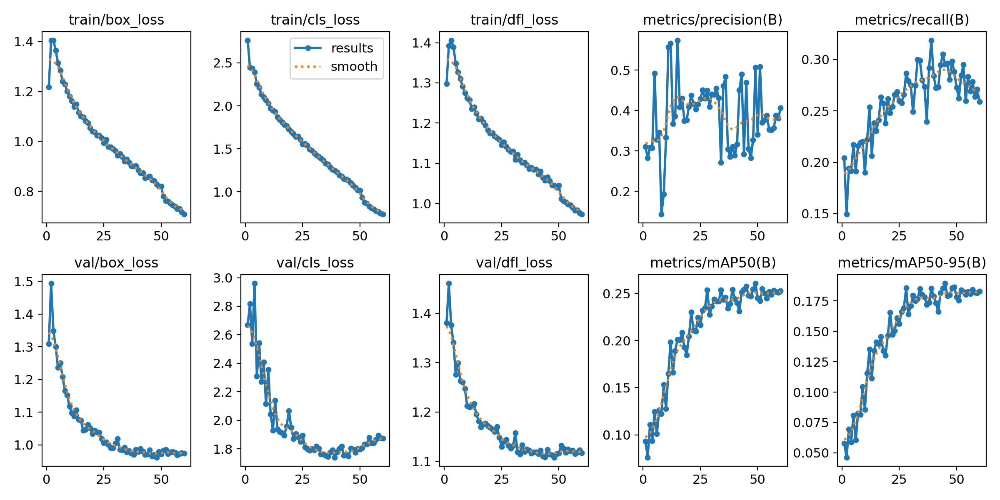

# WasteScope
# WasteScope
AI BASED ENGINE FOR WASTE CLASSIFICATION


A GPU inference engine for drone cleanliness surveys of ghats and water-body
banks. A high-resolution frame is cut into overlapping tiles, each tile goes
through a waste detector, and the results are merged into per-class counts and
a coverage score for the frame.

Python is used only to train and export the model. Everything that runs on a
frame is C++ and CUDA.

## Layout

| Path | What it is |
|---|---|
| `engine/src/gpu_pipeline.cu` | CUDA kernels: fused tile preprocessing, output decoding, NMS mask, coverage |
| `engine/src/main.cpp` | C++ engine: tiling, LibTorch inference on the kernel's buffer, timing, output |
| `python/baseline.py` | The same pipeline in plain Python, used as the benchmark baseline |
| `tools/compare.py` | Checks the two agree and prints the per-stage speedup |
| `train/` | TACO download and conversion, fine-tuning, TorchScript export |
| `scripts/run_all.sh` | End-to-end driver for Colab and Kaggle |
| `waste_engine.ipynb` | Notebook that runs everything with one *Run all* |
| `CNN.py`, `yolo.cfg`, `coco.names` | The original YOLOv3 demo, kept for reference |

## Running on Colab or Kaggle

Use a GPU runtime (on Kaggle, also turn internet on).

```
!git clone https://github.com/venkat2912/WasteScope.git
%cd WasteScope
!bash scripts/run_all.sh smoke
```

`smoke` needs no training: it exports the stock COCO model, builds the engine,
runs it and the baseline on a sample image, and prints the comparison.

```
!bash scripts/run_all.sh train
!bash scripts/run_all.sh bench
```

`train` downloads TACO, fine-tunes YOLO11s on 6 material classes (plastic,
paper/cardboard, metal, glass, organic, other) and exports it. `bench` compares
the engine with the baseline on a validation image. `EPOCHS`, `BATCH`, `REPEAT`
and `IMAGE` can be set as environment variables.

The training set is each image plus the 640-pixel tiles the engine would cut
from it. The image host throttles bulk downloads, so `train` stops before
training if fewer than 90% of the images arrived; run it again and it fetches
only the missing ones, or set `MIN_FRACTION=0` to train on what is there.

```
!bash scripts/run_all.sh trt
```

`trt` installs TensorRT, builds an FP16 engine from the model, rebuilds the C++
engine with the TensorRT backend and benchmarks it next to the TorchScript one.
A `.engine` file passed as `--model` runs through TensorRT; anything else runs
through TorchScript.

## Running the engine directly

```
./build/waste_engine --model models/waste.torchscript --classes models/waste.names \
    --input survey.jpg --out annotated.jpg --json result.json
```

A video file as `--input` gives per-frame scores with `--csv scores.csv`.
`--batch` must match the batch size the model was exported with.

## How a frame is processed

1. The frame is copied to the GPU once.
2. One kernel crops every tile, resizes and letterboxes it, converts BGR to
   RGB, normalises and writes it in CHW layout into the batch buffer.
3. LibTorch runs the model on that buffer without copying it.
4. A kernel thresholds the raw output and maps boxes back to frame coordinates.
5. Candidates from all tiles are sorted on the GPU and a kernel builds the
   pairwise overlap mask; the final scan over the mask runs on the CPU. An
   object larger than a tile is reported in pieces by several tiles, so boxes
   of the same class are matched on intersection over the smaller box and the
   kept box grows to cover the pieces it absorbs. `--metric iou --no-merge`
   gives plain non-max suppression instead.
6. A kernel measures the fraction of the frame covered by the kept boxes.

## Measured speed

One 1920x1440 validation photo, cut into 13 tiles and run in batches of 8, on a
Tesla T4. Mean of 48 runs, in milliseconds per frame. Within each run the three
pipelines produced identical detections.

Kaggle (CUDA 12.8, TensorRT 11.3), with the model trained on the full dataset:

| Stage | Python baseline | C++ engine, TorchScript FP32 | C++ engine, TensorRT FP16 |
|---|---|---|---|
| Preprocess | 38.2 | 2.6 | 2.6 |
| Inference | 123.1 | 133.8 | 33.2 |
| Postprocess | 4.2 | 0.3 | 0.3 |
| Total | 165.4 (6.0 fps) | 136.7 (7.3 fps) | 36.1 (27.7 fps) |

Colab (CUDA 13.0, TensorRT 11.3), with an earlier model:

| Stage | Python baseline | C++ engine, TorchScript FP32 | C++ engine, TensorRT FP16 |
|---|---|---|---|
| Preprocess | 40.1 | 2.5 | 2.5 |
| Inference | 154.7 | 162.9 | 31.8 |
| Postprocess | 4.4 | 0.3 | 0.2 |
| Total | 199.1 (5.0 fps) | 165.7 (6.0 fps) | 34.6 (28.9 fps) |

The engine's time is the same on both; the end-to-end speedup is 4.6x on Kaggle
and 5.8x on Colab because the Python baseline ran faster on Kaggle.

Both runs used plain non-max suppression, before box merging was added. Merging
changes only the last, CPU-side step, on both sides of the comparison.

## Measured accuracy

YOLO11s fine-tuned for 60 epochs on all 1,500 TACO photos plus their tiles
(6,422 training images), scored on 1,062 held-out validation images.

| Class | Validation objects | Precision | Recall | mAP50 | mAP50-95 |
|---|---|---|---|---|---|
| all | 1929 | 0.47 | 0.29 | 0.257 | 0.189 |
| plastic | 932 | 0.52 | 0.52 | 0.493 | 0.367 |
| metal | 263 | 0.50 | 0.52 | 0.483 | 0.385 |
| paper/cardboard | 273 | 0.42 | 0.44 | 0.343 | 0.247 |
| other | 433 | 0.35 | 0.24 | 0.190 | 0.108 |
| glass | 20 | 0.02 | 0.05 | 0.033 | 0.029 |
| organic | 8 | 1.00 | 0.00 | 0.000 | 0.000 |

The detector finds about half of the plastic and metal and is not reliable for
the other classes. Glass and organic have too few examples in TACO to learn or
to measure.

The training curves, confusion matrix and raw benchmark output of that run are
in `results/`.



## Limits

- Coverage is measured from boxes, so it overstates the true waste area. Masks
  from a segmentation model would fix that.
- TACO is ground-level litter. Drone footage and ghat-specific waste such as
  floral offerings need local images added to the training set.
- INT8 quantisation, pinned memory with CUDA streams, and a PyTorch extension
  for the kernels come next.
